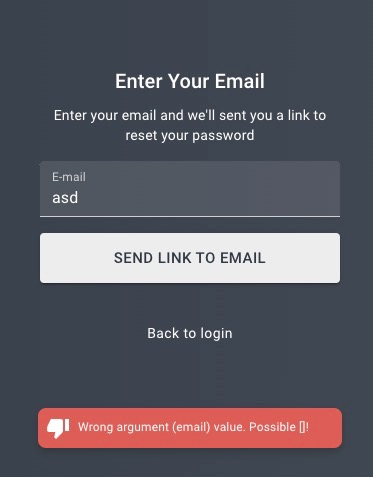
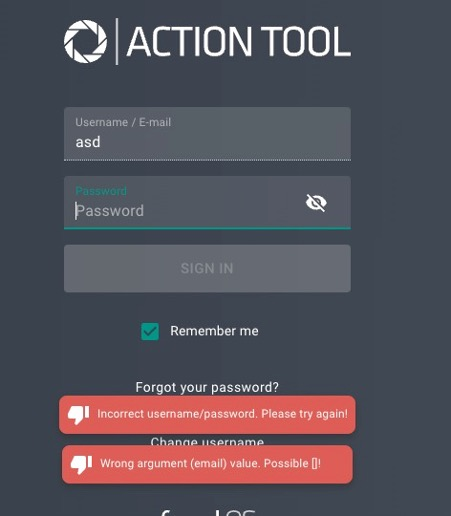

# Issues:

## 1. Invalid error message when inputting incorrect email for password reset
The error message that appears when an incorrect email value is entered for a password reset is vague and not user-friendly. These messages can potentially reveal a stacktrace of the error or other internal information, which can be a security concern.

## 2. Error message for invalid username/password when navigating back from 'Forgot Password' page
If a user visits the 'Forgot Password' page, enters an invalid email, and then clicks the 'Send Link' button, an error message appears. If the user subsequently clicks the 'Back' button to return to the login page, they encounter not only the initial error but also a new error regarding an incorrect username/password.

## 3. Password field resets upon clicking login input
When a user enters their login and their password, and realizes that login is incorrect, they click on the login input. This action takes them back to step 1 of the 2-step login process. Also it clears the password field, requiring its re-entry. The system should allow users to correct their login information during the second step without reverting back to the first step.

## 4. Unintended revert from reset password page to login page after incorrect login/password was provided
If user enters an incorrect login or password and clicks "Sign In”, and then immediately clicks the "Forgot your password" button before the error prompt appears, they are initially directed to the reset password page. However, they are then automatically redirected back to the login page.

## 5. Unnecessary 'Change Username' button
The 'Change Username' button is not needed. Users typically click on the username input to make changes to their username, rendering the 'Change Username' button redundant.

